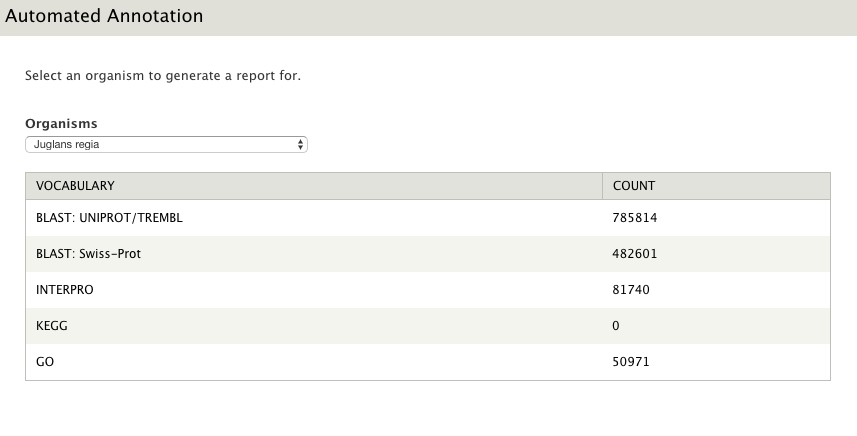

This module allows you to generate annotation reports for organisms. By generating
a table of available annotations per organism, you'll be able to see which
vocabularies/databases are missing. It'll also email a report each month.

## Installation

Download and place in your Drupal modules directory, then run:

```bash
drush en -y automated_annotation
```

## Configuration

Visit `admin/reports/automated-annotation/settings` to configure the module.

## Displaying Reports

Visit `admin/reports/automated-annotation/report` to view reports.



## License

This software is licensed under GPLv3.

*Copyright 2018 University of Tennessee Knoxville*
